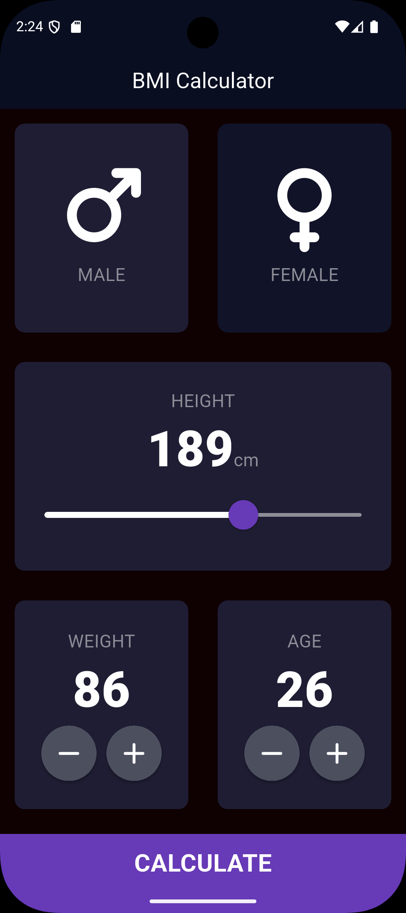
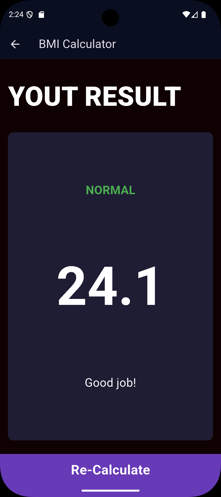

# BMI Calculator 🧮

A simple and clean **BMI Calculator** mobile application built with **Flutter** and **Dart**.

The application calculates Body Mass Index (BMI) based on the user's height and weight and displays the result with an appropriate interpretation.

## 📱 Program Image


## 📌 About the Project

This project is a Flutter BMI Calculator application created to practice Flutter development and learn how to build a multi-screen mobile application.

The project uses reusable widgets and separates the application into different components and screens to keep the code organized and maintainable.

## ✨ Features

* 👤 Gender selection
* 📏 Height selection
* ⚖️ Weight selection
* 🧮 BMI calculation
* 📊 BMI result display
* 💬 BMI interpretation
* 🔄 Recalculate BMI
* 🧩 Reusable UI components
* 📱 Clean and responsive interface

## 🛠️ Technologies

* **Flutter**
* **Dart**
* **Material Design**
* **Font Awesome Icons**

## 📂 Project Structure

```text
lib/
│
├── components/
│   ├── bottom_button.dart
│   ├── icon_content.dart
│   ├── reusable_card.dart
│   └── round_icon_button.dart
│
├── screens/
│   ├── input_page.dart
│   └── results_page.dart
│
├── calculate_brain.dart
├── constants.dart
└── main.dart
```

### Components

The `components` folder contains reusable UI widgets:

* `bottom_button.dart` — Button used at the bottom of the pages
* `icon_content.dart` — Displays icons and labels
* `reusable_card.dart` — Reusable card widget
* `round_icon_button.dart` — Circular buttons for increasing/decreasing values

### Screens

The `screens` folder contains the main application pages:

* `input_page.dart` — Main BMI input screen
* `results_page.dart` — Displays the calculated BMI and result

### Core Files

* `calculate_brain.dart` — Contains BMI calculation and result logic
* `constants.dart` — Contains application constants and styles
* `main.dart` — Application entry point
